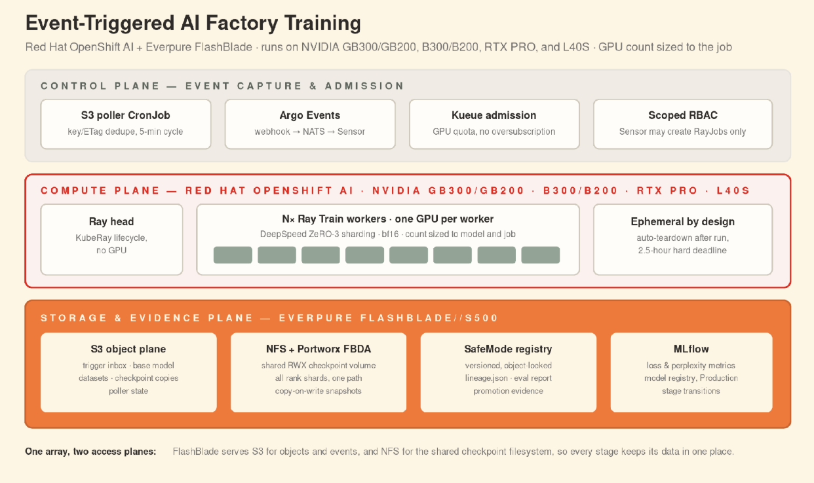
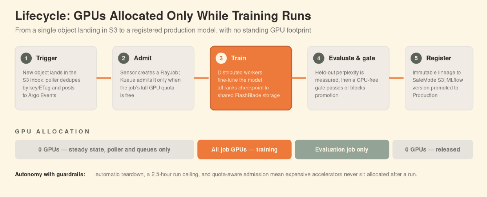
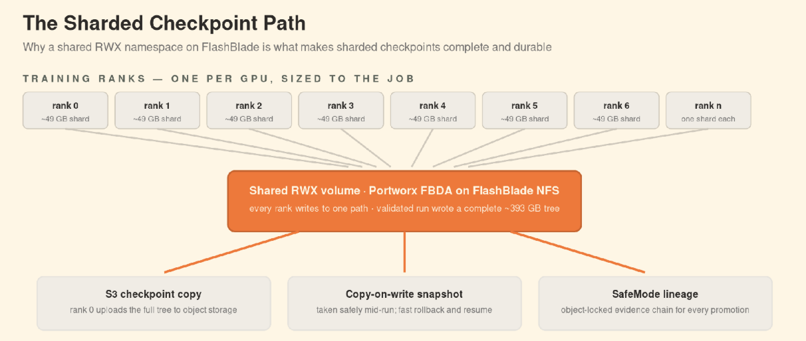

# Autonomous Training Pipeline

[](LICENSE)
[](ENVIRONMENT-CONTRACT.md#1-platform)

**Drop a file in a bucket; get a fine-tuned model back.**

An event-driven LLM fine-tuning pipeline for OpenShift. An object landing in an S3 bucket triggers
a distributed training run on GPUs, checkpoints to shared flash storage, verifies the checkpoint,
evaluates it on held-out data, and registers the result — with no human in the loop after the
upload.

## Why this?

- **It is reproducible, and that is measured.** No random seed is involved: the training loop has
  no randomness to seed at all — a fixed, unshuffled data walk over pretrained weights with no new
  random initialization. If a rebuild's loss moves, something moved. The specific number recorded
  across the first 8 reproductions (`0.6574476957321167`) came from every rank reading the same
  fixed sample window; each rank now reads a distinct offset into that window instead, so a run
  under the current code trains on different data and produces its own baseline value — see
  [docs/results.md](docs/results.md#reproducibility) before treating the recorded number as a target.
- **The storage cost of training is visible.** Every run publishes what the array actually did:
  peak write bandwidth, IOPS, and the volume occupancy of a single checkpoint. The bottleneck in
  this pipeline is not the filer, and the numbers in docs/results.md show you why.
- **The environment contract is the deliverable.** Not "it worked on our cluster" — a stated set of
  requirements with a floor and a tested value for each, and a script that tells you in thirty
  seconds whether yours satisfies them.

## Architecture



Three planes, one array. The control plane (top) only captures events and decides whether to admit
a run — it holds no GPU and no training state. The compute plane (middle) is a Ray cluster that
exists only while a job runs: one head pod with no GPU, and one worker pod per GPU. The storage and
evidence plane (bottom) is FlashBlade, serving two roles at once — an S3 endpoint for the trigger
object, the base model and the checkpoint archive, and an NFS export for the shared checkpoint
volume every worker writes to.



A run moves through five stages: an object triggers the pipeline, Kueue admits it once GPU quota is
free, training runs on all requested GPUs, evaluation checks the result on held-out data, and a
passing result gets registered. The bottom timeline is the point of the whole design: GPU
allocation tracks the stage exactly. Zero GPUs sit idle at steady state, and zero GPUs sit idle
again once training and evaluation finish — nothing is held after a run completes.



Each training rank (one per GPU) owns one shard of the checkpoint and writes it to the same shared
RWX volume on FlashBlade NFS. From that one volume, three things happen: rank 0 uploads the full
checkpoint tree to S3 for durability, a copy-on-write snapshot is taken for fast rollback, and a
SafeMode-protected lineage record is written so a promoted model can always be traced back to the
run that produced it.

## Quick start

```bash
./preflight.sh -n ml-training      # does your cluster satisfy the contract?
cp -r overlays/example overlays/mine   # then edit — see Minimum configuration below

make apply-phase OVERLAY=overlays/mine PHASE=00-platform   # ⚠ see "The phases" below before running this
make apply-phase OVERLAY=overlays/mine PHASE=10-storage
make apply-phase OVERLAY=overlays/mine PHASE=20-events
make apply-phase OVERLAY=overlays/mine PHASE=30-pipeline
```

Then fire a run — `scripts/trigger-validation-object.yaml` writes the one object that starts it,
from inside the cluster, since the data VIP is usually not routable from a workstation:

```bash
oc -n ml-training create -f scripts/trigger-validation-object.yaml   # edit OBJECT_NAME/RUN_LABEL first
oc -n ml-training create job trigger-poll --from=cronjob/s3-poller
oc -n ml-training get rayjob -w
```

Full detail, including why this cannot be an `apply`, is in
["Fire a run" in getting-started](docs/getting-started.md#9-fire-a-run).

`preflight.sh` is read-only and fails fast: it checks the platform floor, nine required CRDs, GPU
node labels and allocatable count, StorageClass reclaim policy, Secret keys, and — the one that
bites hardest — whether your Kueue quota can actually admit a run. **Quota below the floor does not
error. It hangs**, with no event on the pod, because there is no pod yet.

## Minimum configuration

Three things are yours, and nothing else has to change. The bucket names below are illustrative —
replace them with your own; do not copy them as-is, and do not fall back to the base's shipped
placeholders (`my-models`, `my-inbox`, `my-registry`), which `preflight.sh` rejects outright.

```yaml
# overlays/<yours>/30-pipeline/kustomization.yaml
namespace: ml-training                    # 1. where the pipeline runs

configMapGenerator:
  - name: pipeline-config                 # 2. your bucket names
    behavior: merge
    literals:
      - S3_DATA_BUCKET=acme-corp-training-datasets
      - S3_VALIDATION_BUCKET=acme-corp-inbox      # MUST differ from S3_DATA_BUCKET
      - S3_REGISTRY_BUCKET=acme-corp-model-registry
```

3. One Secret, `flashblade-s3`, with `AWS_ACCESS_KEY_ID`, `AWS_SECRET_ACCESS_KEY` and
   `S3_ENDPOINT`. How you create it is your choice — sealed secrets, an external secrets operator,
   `oc create secret`. The manifests reference it by name and key only and ship no credentials.

**The inbox and the dataset bucket must be different buckets**, or every dataset upload fires a
training run. Everything else — GPU model pinning, quota, alert thresholds, Prometheus retention —
has a documented override in `overlays/example/`, commented out and ready.

## What you get

One run, measured end to end:

```
RayJob qwen3-fbda-auto-dkb9p          SUCCEEDED       122 min

  Training      60 steps, loss 2.0367 -> 0.6574
  Checkpoint    verified: world_size=8, 18 objects, manifest written last
  Determinism   0.6574476957321167   (bit-identical, 8 consecutive reproductions)

  Storage, peak during the checkpoint barrier
    Array write bandwidth      7,123 MB/s
    Array write IOPS          13,589 /s
    Array read IOPS           12,461 /s
    Volume occupancy         444.8 GiB of 800 GiB   (peak: checkpoint + base model + datasets + logs)
    Volume after reclaim      18.9 GB
```

The array sustained that while **every GPU sat idle waiting on the write**. Full numbers, and what
the `Determinism` line above actually measures, are in
[docs/results.md](docs/results.md#reproducibility).
The two console dashboards are manifests, not screenshots —
`base/00-platform/dcgm-console-dashboard.yaml` and `base/00-platform/training-run-console-dashboard.yaml`
install them into the OpenShift console.

## How it works

```
   object lands in S3 inbox
            │
            ▼
   CronJob poller  ──POST──►  Argo Events  ──creates──►  RayJob
   (dedupes by etag)            Sensor                     │
                                                           ▼
                                              8 GPUs, DeepSpeed ZeRO-3
                                                           │
                              ┌────────────────────────────┤
                              ▼                            ▼
                   checkpoint to RWX volume        metrics + loss
                   (NFS, shared)                   to Prometheus/MLflow
                              │
                              ▼
                   verify shards ──► upload to S3 ──► reclaim local copy
                              │
                              ▼
                   eval on held-out data ──► gate ──► register in MLflow
```

## Prerequisites

Stated as a floor, with the value it was tested at. `./preflight.sh` checks all of it.

| Requirement | Floor | Tested with |
|---|---|---|
| Platform | **Red Hat OpenShift** — not Kubernetes | OCP 4.18.37 |
| Kubernetes | ≥ 1.31 | v1.31.14 |
| GPU nodes | ≥ 2, CUDA-capable, enough VRAM for full-parameter fine-tuning of a 32B model under ZeRO-3 with full CPU offload | 2 × NVIDIA L40S, 8 GPUs total |
| GPU quota | 8 GPU · 56 CPU · 1600 Gi · 720 Gi ephemeral-storage, admitted by a Kueue ClusterQueue | same |
| Storage | RWX class over NFS with `reclaimPolicy: Retain`, ≥ 1,120 GiB free (800 for the pipeline's own volumes, 300 more for phase 00's monitoring stack on the same class — see [contract §1](ENVIRONMENT-CONTRACT.md#1-platform)) | FlashBlade via Portworx CSI |
| Object store | S3-compatible, three buckets | FlashBlade S3 |
| Operators | GPU Operator, NFD, Portworx, OpenShift AI, Argo Events | see [contract §2](ENVIRONMENT-CONTRACT.md#2-operators-and-crds--install-these-first) |
| Local tooling | `kubeconform`, on the machine that runs `make validate` | — |

**`make validate` needs `kubeconform` on your `PATH` to actually validate anything.** Without it,
the `Makefile`'s `validate` target still renders every phase and still reports `ok`, but it silently
skips schema validation entirely — it prints a note, not a failure, so a missing `kubeconform`
looks identical to a clean pass.

**This runs on OpenShift, not on Kubernetes.** `base/00-platform` uses `MachineConfig` and
`MachineConfigPool`, the event layer needs `runAsUser: 9731` patched out of the Argo Events
controller Deployment before OpenShift's namespace UID range will accept it, and operator install
assumes OLM. Porting is a rewrite of that phase, not a configuration change.

**Sizing follows one checkpoint, not a percentage.** Volume occupancy peaked at 444.8 GiB — the base
model, datasets and logs already on the volume, plus one full checkpoint in flight. A platform
default that alerts at "3% free" fires at 24 GB on an 800 GiB volume — an order of magnitude below
one checkpoint alone, which is to say, after the write it was meant to warn you about has already
failed.

## The phases

Applied in order. Kustomize sorts by kind rather than preserving declaration order, so the ordering
lives in the directory structure.

| Phase | Contains | Notes |
|---|---|---|
| `00-platform` | MachineConfigPool, MachineConfig, Kueue quota, dashboards, ServiceMonitors | Applies a MachineConfig and MachineConfigPool for storage-role nodes. **Reboots any node you have labelled `node-role.kubernetes.io/px-storage`** — on a fresh install that is none, and nothing reboots. |
| `10-storage` | StorageCluster, StorageClasses, VolumeSnapshotClass | ~5–10 min to Running |
| `20-events` | Argo Events EventBus, EventSource, Sensor | product-owned namespace |
| `30-pipeline` | the application: MLflow, RBAC, ConfigMaps, poller, PVCs | namespace set by your overlay |
| `40-workloads` | **opt-in** standing RayCluster and example RayJobs | consumes GPU quota immediately |
| `50-stages` | **opt-in** eval gate and model registration Jobs | needs a completed run |

Full walkthrough: [docs/getting-started.md](docs/getting-started.md).

## Component versions

All overridable in your overlay.

| Component | Tested with |
|---|---|
| OpenShift / Kubernetes | 4.18.37 / v1.31.14 |
| NVIDIA GPU Operator | 26.3.3 |
| Portworx Operator | 26.3.1 (CSI-only OEM mode) |
| OpenShift AI (Kueue, KubeRay) | 2.25.10 |
| Argo Events | 1.9.7 |
| Ray / DeepSpeed / Transformers / PyTorch | explicitly pinned — `rayVersion: "2.52.1"`, `deepspeed==0.19.5`, `transformers==5.15.0`, `torch==2.13.0` in every `runtimeEnvYAML.pip` block and `train/Dockerfile` |
| MLflow | server `ghcr.io/mlflow/mlflow:v2.22.0`; every `runtimeEnvYAML.pip` block pins the client as `mlflow-skinny==3.15.1` — a real 2.x-server/3.x-client version skew, tested and working as shipped |
| Base model | `Qwen/Qwen3-32B` (Apache-2.0) |

## Support

**This is a community-supported reference architecture, not a product.** It ships no binaries and
is not covered by any product support agreement or SLA — see
[CONTRIBUTING.md](CONTRIBUTING.md#reporting-a-security-vulnerability) for the full scope statement.
The channel that works is **opening an issue**; it is read, and a concrete patch attached to an
issue will reach the internal source and appear in a subsequent publish (see
[CONTRIBUTING.md](CONTRIBUTING.md) — pull requests cannot be merged directly, this repository is a
one-way mirror).

**Prerequisite versions are not proactively revalidated.** The versions in the table above are what
this pipeline was built and tested against — a floor, not a rolling target. When OpenShift,
Kubernetes, RHOAI, Portworx, or any other prerequisite ships a new release, nothing here re-runs
against it automatically or on any fixed cadence. Check the version you are actually installing
against [ENVIRONMENT-CONTRACT.md](ENVIRONMENT-CONTRACT.md), and open an issue per the note above if
something changed underneath you — "I ran this on an environment that isn't the one you tested" is
the single most useful report this repository can receive.

## Documentation

- **[ENVIRONMENT-CONTRACT.md](ENVIRONMENT-CONTRACT.md)** — what this needs from your cluster, and
  what it does not give you. **The actual deliverable.**
- [docs/getting-started.md](docs/getting-started.md) — prerequisites through first run
- [docs/troubleshooting.md](docs/troubleshooting.md) — the failure modes that apply cleanly and then do not work
- [docs/results.md](docs/results.md) — measured results
- [docs/what-to-expect.md](docs/what-to-expect.md) — screenshots from a real run: the dashboards,
  the loss curve, checkpoint rollback and eval, and what the array was doing
- [docs/rollback-runbook.md](docs/rollback-runbook.md) — the one destructive operation in this
  pipeline: reverting the checkpoint volume from a snapshot, and how to do it deliberately
- [docs/glossary.md](docs/glossary.md) — GPU and AI/ML terms used throughout these docs, defined
  for how this repo actually uses them
- [CONTRIBUTING.md](CONTRIBUTING.md) — how to report something (and why PRs cannot be merged)

## Limitations

Stated here rather than discovered later. See also
[contract §9](ENVIRONMENT-CONTRACT.md#9-what-this-contract-does-not-give-you).

- **OpenShift only.** See Prerequisites.
- **The GPU model is pinned nowhere, deliberately.** The base selects `nvidia.com/gpu.present`,
  true of any CUDA-capable node, so nothing constrains *which* GPU a job lands on. On a mixed fleet
  pin `nvidia.com/gpu.product` in the Kueue `ResourceFlavor` **and** the workload pod specs, in two
  different places, both via overlay patches — never by editing a base file. The workload pod
  specs' commented patches live in `overlays/example/40-workloads/kustomization.yaml` and
  `overlays/example/20-events/kustomization.yaml`. The `ResourceFlavor`'s own GPU-model selector
  has no ready-made patch in `overlays/example/00-platform/kustomization.yaml`, but
  `base/00-platform/kueue-resourceflavor-gpu.yaml`'s own header comment gives the exact JSON6902
  patch to add to your overlay — copy it from there rather than editing that base file directly.
  Pinning a label no node carries leaves pods `Pending` forever with no error, because that is how
  an unsatisfiable nodeSelector fails.
- **`ray_training_*` metrics depend on a Ray-version-specific workaround, not a platform
  guarantee.** On Ray 2.52+ with `RAY_USE_TLS` enabled, OpenTelemetry (the new default metrics
  backend) fails to reach the dashboard agent, and every RayJob here sets
  `RAY_enable_open_telemetry: "false"` to work around it — see
  [github.com/ray-project/ray/issues/59968](https://github.com/ray-project/ray/issues/59968). The
  run is fully observable through GPU, storage, volume and pod-phase metrics regardless. Confirm
  this family on your own cluster before building an alert on it; a different Ray build or TLS
  configuration may need a different fix.
- **Ray log growth on the shared volume is unbounded.** Ray's session directory is persisted so
  logs survive teardown. Watch free space before running many jobs back to back.
- **Alert-expression satisfiability is checked, but only against a live cluster.** Valid PromQL
  syntax is not the same as an expression that can ever return data — a metric name that is
  typo'd, renamed, or simply not emitted on this platform is syntactically fine and semantically
  dead. `scripts/check-alert-satisfiability.sh` (`make check-alerts`) confirms every metric name a
  shipped rule references is actually registered on your cluster's Prometheus. It needs a live
  cluster, so it is not part of the render-only `make validate` path — run it yourself before
  depending on an alert.
- **The S3 poller ships suspended, and re-applying the pipeline phase resets it back to
  suspended.** This is deliberate — an unconfigured bucket on a fresh install would otherwise fire
  a red alert every five minutes — but it means un-suspending it (see
  [applying the phases, in getting-started](docs/getting-started.md#5-apply-the-phases-in-order))
  does not survive a later re-apply of the same phase.
- **No CI.** Nothing runs the checks in [CONTRIBUTING.md](CONTRIBUTING.md) automatically; run them
  yourself.
- **Contributions cannot be merged as pull requests** — this repository is a one-way mirror.

## Licence

Copyright 2026 Everpure, Inc. Licensed under the [Apache License 2.0](LICENSE).
