# What to Expect

A walkthrough of what a real run actually looks like, organized around the three stages this
pipeline actually produces: **the training run, checkpoint rollback and resume, and held-out
eval.** Every screenshot below is a real capture from a full teardown back to before phase 00,
followed by a fresh rebuild from this repo's own published instructions, then training, resume and
eval fired in sequence. That is a stronger starting point than a
pre-provisioned container: nothing here was left over from a prior run. [docs/results.md](results.md)
has the exact numbers; this page is about what you'll see while it happens, and why that
particular view is the one worth watching. Unfamiliar terms (GPU utilization, perplexity, ZeRO-3,
and others) are defined in [docs/glossary.md](glossary.md).

Each stage below shows its own dashboard capture, framed to a time window that includes only that
stage — a short checkpoint-resume test sitting a few minutes after a two-hour training run does not
show up looking the same as the training run itself, and shouldn't be confused for it.

---

## Stage 1 — the training run

`base/00-platform/training-run-console-dashboard.yaml` installs this into
**Observe → Dashboards → AI Training Run** in the OpenShift console. It's the first place to look
once a run has fired. The full dashboard ships more panels than fit comfortably in a walkthrough;
the five below are the ones worth watching most closely.

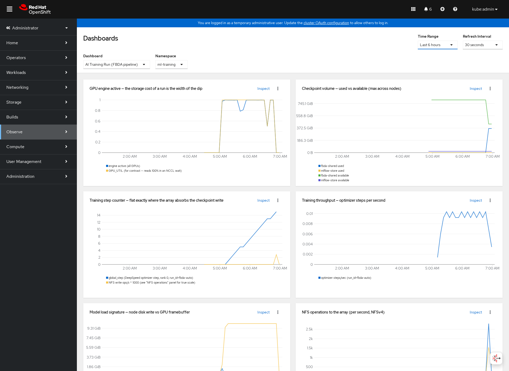

**GPU engine active — the storage cost of a run is the width of the dip.** This is the panel worth
watching most closely. The blue line is GPU engine utilization; the gold line is `GPU_UTIL`, shown
for contrast because it reads 100% even while a GPU is stalled in an NCCL collective, doing no
useful work. Every dip in the blue line while gold stays high is the checkpoint barrier — all 8 GPUs
idle, waiting on a write to the shared volume. **The width of that dip is the storage cost of a run.**
A faster array narrows it; a slow one widens it. This is the one number in the whole dashboard that
turns a storage claim into something you can literally watch on a graph.

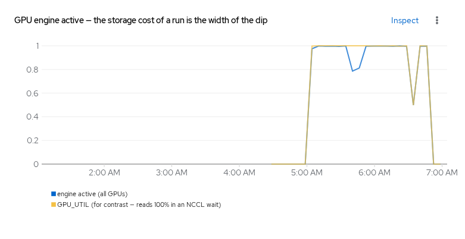

**Checkpoint volume — used vs available.** Two pairs of lines: `fbda-shared` (the training
checkpoint volume) and `mlflow-store` (MLflow's own backing volume), each showing used and
available capacity. Watch `fbda-shared used` step up sharply during the checkpoint barrier above,
then step back down once the upload-and-reclaim finishes — that step-down is `KEEP_LOCAL_CKPT`
*not* being set (see [getting-started.md](getting-started.md) if you want to keep the local copy
instead).

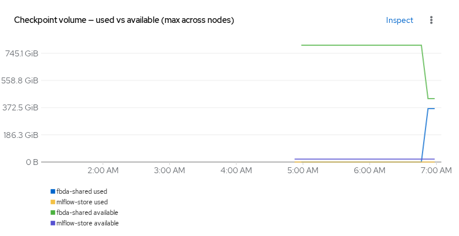

**Model load signature — node disk write vs GPU framebuffer.** The gold spike is the base model
being loaded into GPU memory; the blue line underneath is node-local disk write, which barely
moves, because the model is streamed rather than staged to local disk first. This panel is what
confirms a run actually *started* — a RayJob can reach `Running` phase with an empty framebuffer if
model download is still in progress, and this is the fastest way to tell the difference between
"loading" and "stuck."

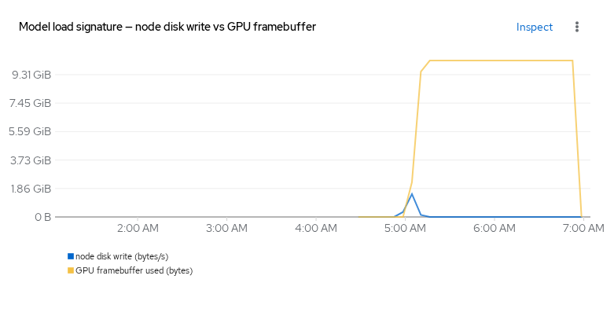

**NFS operations to the array (per second, NFSv4).** Read and write ops/s against the FlashBlade
NFS export. The spikes line up with the checkpoint barriers in the GPU panel above — this is the
same event, seen from the storage side instead of the compute side.

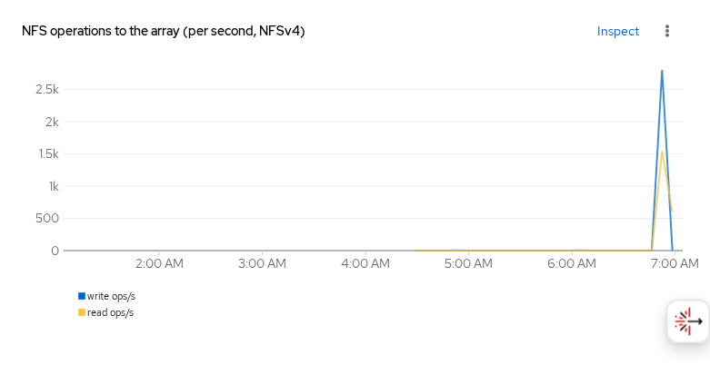

**Run state — pods by phase.** `Running`, `Pending`, `Succeeded`, `Failed`, `Unknown` counts over
time. The step from 1 `Running` up to the full worker count is the RayCluster scaling up to admit
the job.

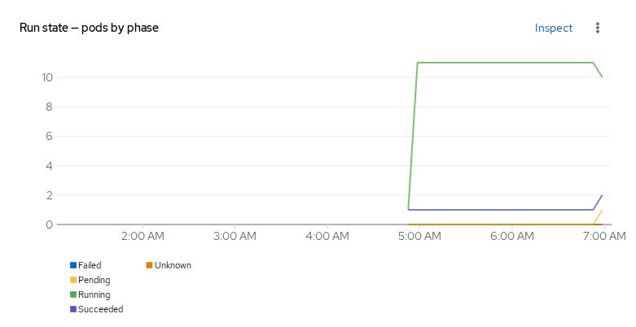

### GPU utilization and power draw

`base/00-platform/dcgm-console-dashboard.yaml` installs a second dashboard —
**Observe → Dashboards → NVIDIA GPU (DCGM)** — with per-GPU detail rather than the aggregate view
above. This is where "zero standing GPU footprint" becomes visible rather than asserted: every GPU
sits at 0% utilization and near-idle power draw right up until the RayCluster admits the job, then
saturates for the training window, then drops back to idle the moment
`shutdownAfterJobFinishes`/`ttlSecondsAfterFinished` tears the cluster down (see
[the rayjob-train-ephemeral.yaml header](../base/40-workloads/rayjob-train-ephemeral.yaml) for
exactly how that timing works, and why cleared Kueue quota isn't the same signal as GPUs actually
being free).

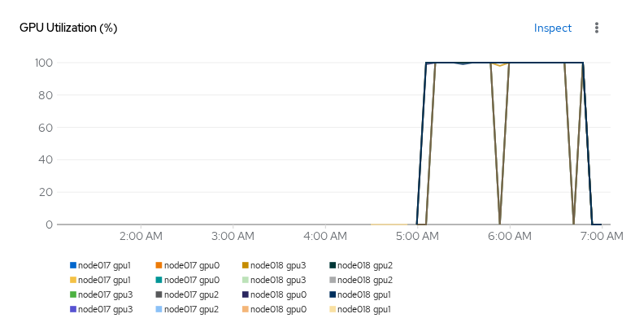

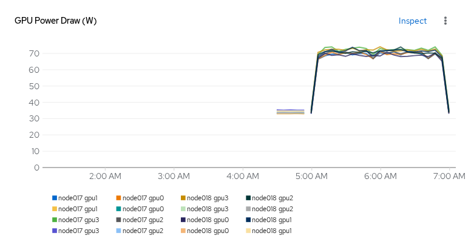

The full DCGM dashboard also has Framebuffer Used and Temperature panels, following the same shape:

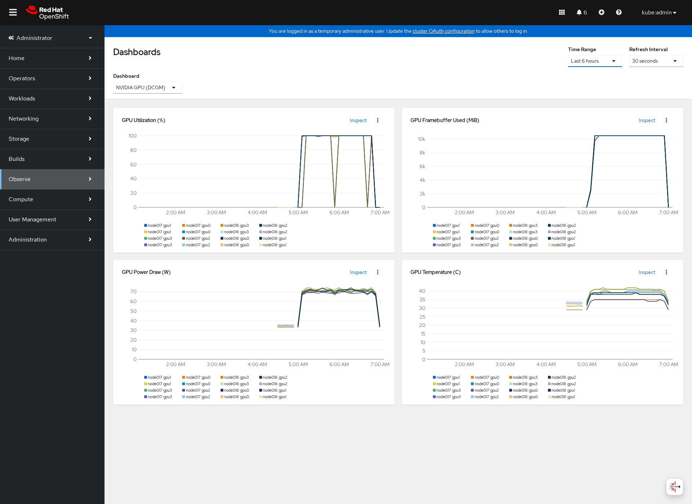

### Confirming it actually trained

A RayJob reaching `SUCCEEDED` tells you the process exited zero. It does not tell you the model
learned anything — a training loop that silently no-ops (wrong dataset path, a broken data loader,
a learning rate of zero) can exit just as cleanly. The loss curve is the thing that actually proves
training happened:

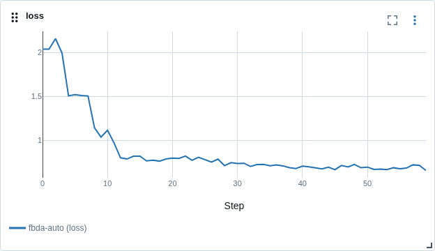

That shape — a steep early drop followed by a long, slow tail — is what fine-tuning a pretrained
model on a small, consistent dataset is supposed to look like. A flat line at the starting value
means nothing updated; a line that jumps around with no downward trend means the learning rate or
data is wrong. [docs/results.md](results.md#reproducibility) has the exact final value
(`0.6574476957321167`) and what it does and doesn't reproduce — this chart is pixel-identical to
the same chart from an earlier run of the same data-walk configuration, because the underlying loss
values were bit-identical across all 60 steps.

---

## Stage 2 — checkpoint rollback and resume

The MLflow experiment carries every run the pipeline produces, under one experiment
(`qwen3-fbda`):

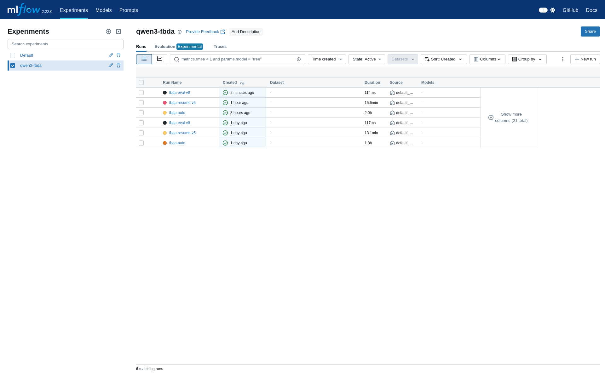

`fbda-resume-v5` is what proves the checkpoint rollback story in
[rollback-runbook.md](rollback-runbook.md): reverting the shared volume to a prior snapshot and
resuming training from it, rather than restarting from scratch. It ran roughly 20 minutes after the
training run above finished — short enough that a dashboard framed to catch it needs a deliberately
narrow time window, or the two-hour training run swamps the chart.

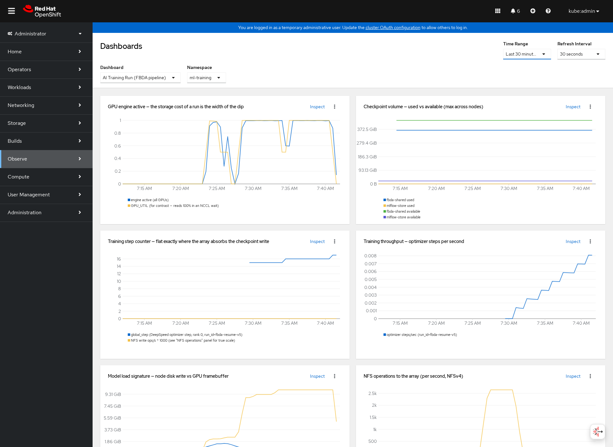

**The proof that this is a genuine resume, not a restart, is the step counter.** DeepSpeed's
`engine.global_steps` continues from where the training run's checkpoint left off (step 15) rather
than restarting at zero:

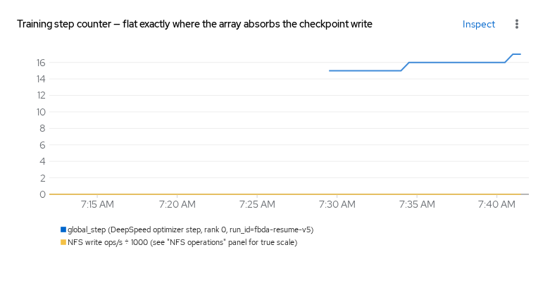

GPU engine activity during resume shows two distinct phases rather than one wide dip — consistent
with loading the checkpoint itself (roughly 80 seconds for a cold read of this size, measured
directly in the training code's own timing log) before the short training loop that follows
actually runs:

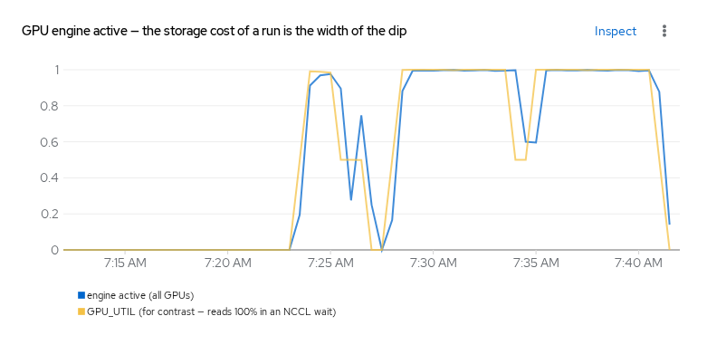

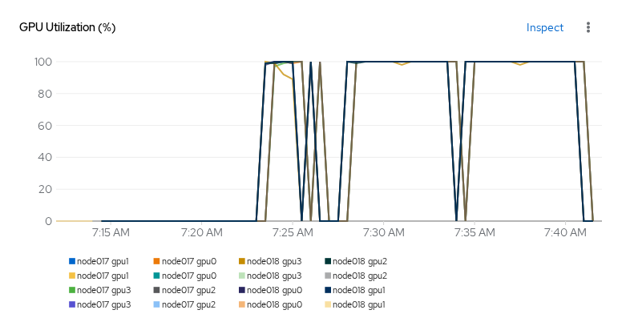

MLflow confirms the same thing from the loss side — this run's loss starts at roughly 0.69, not
back up near 2.0, because it is continuing a model that was already fine-tuned rather than starting
from the base checkpoint:

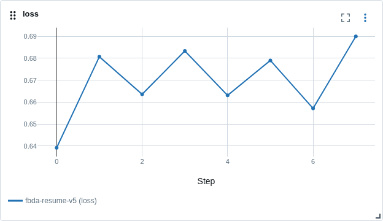

---

## Stage 3 — held-out eval

`fbda-eval-v8` is the held-out evaluation, run separately so a slow eval pass (see the note in
results.md about why it's slower than it should be) never blocks or delays the training run itself.
It fired about 10 minutes after the resume run above finished:

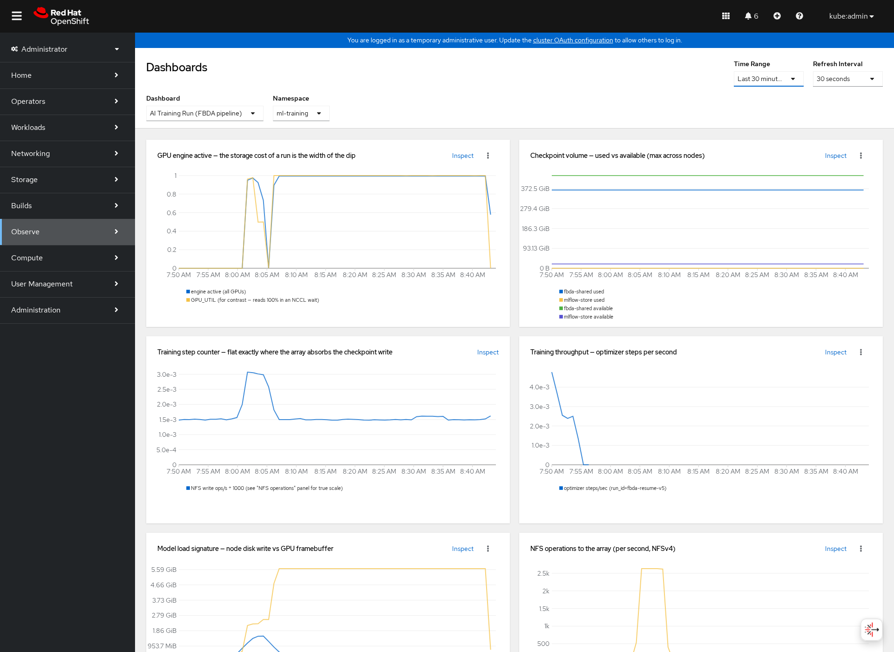

Eval is forward-only — it computes loss and perplexity over held-out data but writes no checkpoint
and takes no optimizer step. GPU engine activity still shows real work happening (model load, then
sustained forward passes), but the shape is visibly different from a training run's checkpoint-dip
pattern, because there is no checkpoint write to dip around:

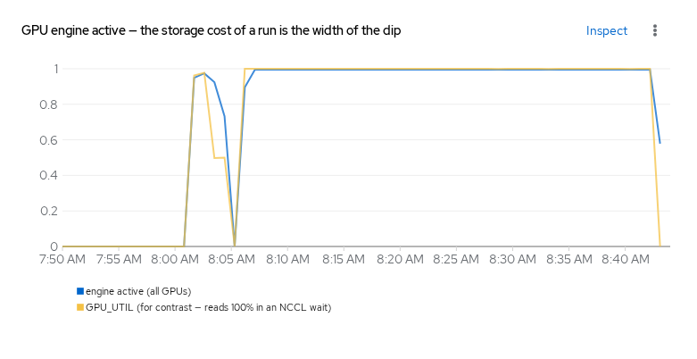

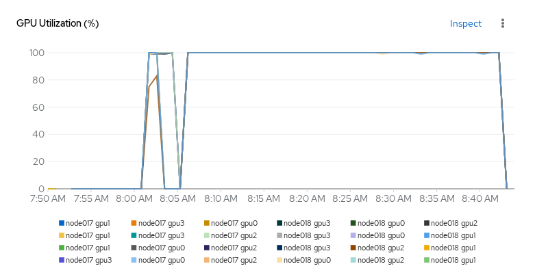

The actual eval metrics — this is the number that answers "did the model get better," not just
"did the process exit cleanly":

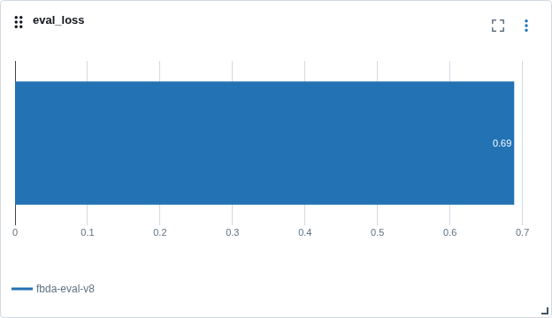

**Why perplexity, and why lower is better.** Perplexity is `exp(cross-entropy loss)` — it measures
how surprised the model is by the actual next token in held-out data it never trained on. A lower
number means the model assigns higher probability to what actually comes next, i.e. a better fit.
It was chosen over raw loss because it's the standard, comparable unit for language-model quality;
`docs/results.md` has the caveat on why this particular number isn't comparable to a
*published* perplexity figure (the 64 independent 128-token windows here are scored with almost no
context on their opening tokens, which is a harsher setup than a standard sliding-window
measurement — but it's a fair *relative* gate, since that bias is constant from run to run).

---

## What the array was doing

FlashBlade's own performance view, captured during the training run above, split by protocol. The
resume and eval windows are too short to frame separately on this UI — it offers only fixed windows
(5 Minutes / 3 Hours / 24 Hours / ...), none of which can isolate a 27-minute or 50-minute run
sitting shortly after a two-hour one without also pulling in the longer run's data. The pattern
below is the same one that repeats at smaller scale in both:

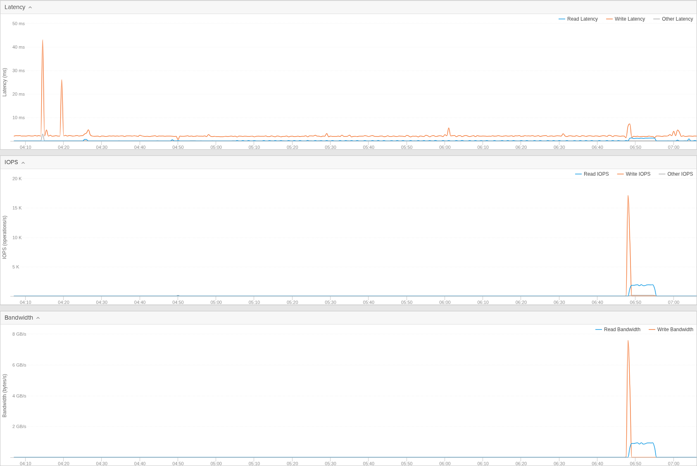

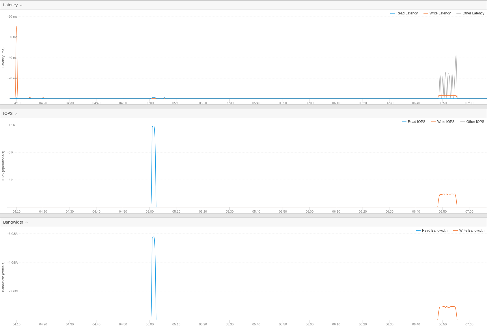

This is the same event as the GPU-engine-active dip in the console dashboard, from the array's own
point of view: near-zero the rest of the time, then a sharp burst that lines up exactly with the
checkpoint barrier. `docs/results.md` has the peak numbers from the array-side capture that
established this pattern (7,123 MB/s write bandwidth, 13,589 write IOPS) — the shape you see here is
the same signature, not a different measurement.

Storage capacity and object counts, for context on what a validated array actually holds day to
day — unchanged across all three stages of this run, since none of them create or
delete a file system, bucket, or snapshot:

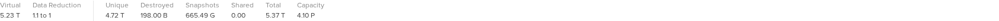

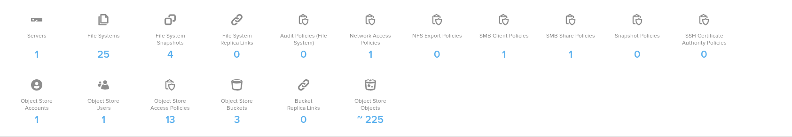

---

## Where the exact numbers live

This page is about recognizing what a healthy run looks like. For the precise figures —
durations, IOPS peaks, the reproducibility count, and the things that *didn't* work — see
[docs/results.md](results.md). For how to fire a run yourself and reproduce any of the above,
start at [docs/getting-started.md](getting-started.md). If what you see does not match this page,
[docs/troubleshooting.md](troubleshooting.md) covers the failure modes that apply cleanly and then
do not work.
